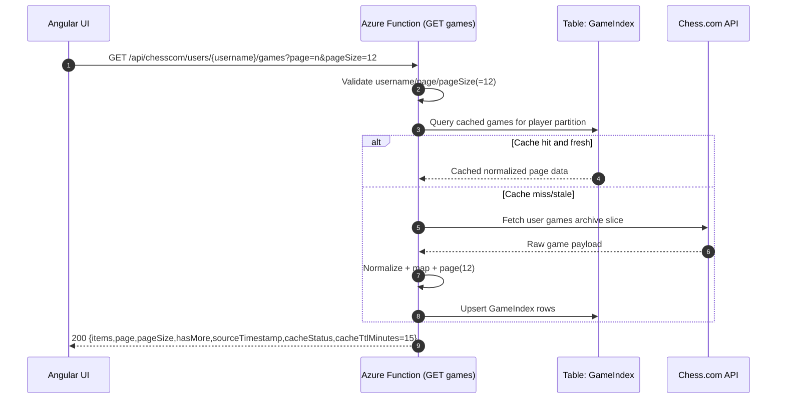
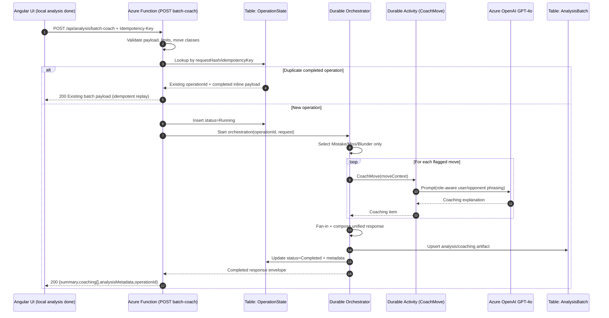

# System Design — Modern Chess Analyzer (MVP)

## 0. Context and Scope
This design uses [docs/prd/prd.md](../prd/prd.md) as product source of truth and [docs/architecture/architect_handoff.md](./architect_handoff.md) as technical context.

MVP flow in scope:
1. User searches Chess.com username.
2. User selects one game from paginated list (12/page).
3. Browser runs local Stockfish.js analysis.
4. Client sends classified Mistake/Miss/Blunder moves for coaching.
5. Backend returns single payload with analysis metadata + coaching.

UI target: the final experience should mirror the attached reference style (board-dominant layout, right-side analysis/coaching panel, move list timeline, and evaluation graph) while keeping MVP scope unchanged. Visual style lock: thick dark outlines, rounded edges, minimalist facial features, flat vibrant colors, and a white border around the shape for pieces/mascot-like/icon assets.

---

## 1) Target Component Architecture

### 1.1 Logical components
- **Web Client (Angular 18, standalone + signals)**
  - Username search + game pagination UI.
  - Board rendering with overlays (origin/destination dim, arrows, classification marker).
  - Iconography/illustrations and coach avatar treatment conform to locked visual style direction from PRD.
  - Local Stockfish.js worker pool and analysis controller.
  - Coach panel rendering from backend batch payload.
- **Mobile Access (Angular 18, browser-based application)**
  - Same web app is mobile-responsive and browsable from user phones.
- **API Layer (Azure Functions, .NET 9 isolated)**
  - `GET /api/chesscom/users/{username}/games`
  - `POST /api/analysis/batch-coach`
- **Orchestration (Durable Functions)**
  - Input validation, idempotency gate, fan-out coaching generation, fan-in aggregation.
- **Data Layer (Azure Table Storage)**
  - `GameIndex`, `AnalysisBatch`, `OperationState`.
- **External Integrations**
  - Chess.com API (proxied via backend).
  - Azure OpenAI GPT-4o (coaching generation).
  - Azure Key Vault (secrets/config).
  - Application Insights + Log Analytics (telemetry).

### 1.2 Trust boundaries
- **Boundary A (Public Client ↔ API):** only HTTPS, strict request validation, throttling/rate limiting.
- **Boundary B (API ↔ Azure Data/AI):** managed identity authentication, private service-to-service auth where available.
- **Boundary C (API ↔ Chess.com):** outbound-only integration via proxy adapter, retry and circuit guard.

### 1.3 Component diagram
```mermaid
flowchart LR
    subgraph ClientTier[Client Tier]
      W[Angular SPA\nSignals + Standalone Components]
      MW[Stockfish.js Web Workers\nLocal WASM Analysis]
      W --> MW
    end

    subgraph AzureTier[Azure Serverless Tier]
      AF[Azure Functions API (.NET 9 Isolated)\nGET games / POST batch-coach]
      DF[Durable Functions Orchestrator\nFan-out/Fan-in coaching]
      KV[Azure Key Vault]
      AI[Azure OpenAI GPT-4o]
      TS[(Azure Table Storage\nGameIndex / AnalysisBatch / OperationState)]
      APP[Application Insights\n+ Log Analytics]

      AF --> DF
      AF --> TS
      AF --> KV
      DF --> AI
      DF --> TS
      AF --> APP
      DF --> APP
    end

    CH[Chess.com Public API]

    W -->|HTTPS| AF
    AF -->|Proxy fetch| CH
```

---

## 2) Sequence Diagrams

### 2.1 GET games — `GET /api/chesscom/users/{username}/games?page=n&pageSize=12`


### 2.2 POST batch coach — `POST /api/analysis/batch-coach`


---

## 3) ADR Decisions (Final)

| ADR | Decision | Rationale | Consequences |
|---|---|---|---|
| ADR-001 Hosting Plan | **Azure Functions Consumption + Durable Functions** for MVP; reevaluate Premium if p95 latency SLO misses | Lowest idle cost, serverless-first, natural orchestration for fan-out coaching | Potential cold starts; mitigate with warm-up strategy and monitor p95 |
| ADR-002 Payload Strategy | **Always inline payload** in `POST /batch-coach` response for MVP | Simplest client contract and matches approved MVP decision | Higher risk of large-response latency/size pressure on long games; mitigate via response-size guards |
| ADR-003 Auth Mode | **MVP anonymous endpoint + rate limiting + abuse controls**, roadmap to Entra auth | Minimizes onboarding friction for consumer UX while containing abuse risk | Must enforce strict throttles, WAF rules, and migration path to authenticated tier |
| ADR-004 Chess.com Caching | **Read-through cache in Table Storage (`GameIndex`)** with **15-minute freshness TTL** and conditional refresh | Reduces external API dependency/latency and avoids repeated normalization work | Slight staleness possible within TTL; surfaced via `sourceTimestamp` and `cacheStatus` |
| ADR-005 Schema Versioning | **Entity envelope versioning (`schemaVersion`) + additive changes only in v1**; breaking changes via new row family or versioned contract | Supports backward compatibility for web clients and future channels | Requires contract tests and documented deprecation windows |

---

## 4) Azure Table Storage Final Partition/Row Key Design

### 4.1 Access patterns to optimize
1. List a player’s recent games by username, paginated.
2. Retrieve batch analysis/coaching for a specific game and latest version.
3. Enforce idempotency and track operation lifecycle by operation/request hash.
4. Cleanup artifacts older than 30 days.

### 4.2 Tables and keys

#### Table: `GameIndex`
- **PartitionKey:** `player#{normalizedUsername}`
- **RowKey:** `game#{reverseTicks}#{chessComGameId}`
- **Why:** keeps per-player games co-located and naturally sorted newest-first with `reverseTicks`.
- **Core columns:** `gameId`, `playedAtUtc`, `opponent`, `result`, `opening`, `timeControl`, `sourceEtag`, `ingestedAtUtc`, `schemaVersion`, `expiresAtUtc`.

#### Table: `AnalysisBatch`
- **PartitionKey:** `game#{gameId}`
- **RowKey:** `analysis#{analysisVersion}#{createdAtUtcTicks}`
- **Why:** all analysis revisions for one game in a single partition; quick fetch of latest via descending timestamp convention.
- **Core columns:** `operationId`, `engineConfig`, `summaryJson`, `coachingCount`, `inlinePayloadJson`, `schemaVersion`, `createdAtUtc`, `expiresAtUtc`.

#### Table: `OperationState`
- **PartitionKey:** `op#{operationId}`
- **RowKey:** `v1`
- **Alt lookup row (same table):**
  - `PartitionKey: req#{requestHashPrefix}`
  - `RowKey: op#{operationId}`
- **Why:** direct operation status read plus efficient dedupe lookup by request hash prefix.
- **Core columns:** `idempotencyKey`, `requestHash`, `status`, `startedAtUtc`, `completedAtUtc`, `retryCount`, `errorCode`, `resultPointer`, `schemaVersion`, `expiresAtUtc`.

### 4.3 Retention implementation
- Retain 30 days using `expiresAtUtc` column + scheduled cleanup Function.
- Cleanup job scans by partition batches and deletes expired rows safely with backoff.

---

## 5) Reliability, Security, Observability Plan

### 5.1 Reliability
- **Idempotency:** require `Idempotency-Key` for `batch-coach`; compute canonical `requestHash` and dedupe through `OperationState`.
- **Durable determinism:** orchestrator contains deterministic logic only; all nondeterministic/IO in activities.
- **Retry policy:** exponential backoff with jitter for transient Chess.com/OpenAI failures; capped retries per move.
- **Timeout budgets:**
  - Per-move coaching timeout (e.g., 8–12s)
  - Batch timeout cap aligned to SLOs: Quick p95 <= 12s, Deep p95 <= 30s
  - API request timeout aligned to orchestration start/return model
- **Partial success policy:** return completed coaching items plus warnings when a subset of move calls timeout/fail.
- **Failure taxonomy:** `ValidationError`, `RateLimited`, `UpstreamUnavailable`, `Timeout`, `OrchestrationFailed`, `PartialCoaching`.

### 5.2 Security
- **Secrets:** all keys/config in Key Vault; no client-side secrets.
- **Identity:** managed identity from Functions to Key Vault, Table Storage, and AI service.
- **Input hardening:** strict schema validation, payload size limits, allowed enum checks for move classes.
- **Network/API:** HTTPS-only, CORS allowlist, IP throttling/rate limits, request correlation and audit events.
- **Data protection:** avoid storing full raw prompts/responses unless redacted; classify logs and mask sensitive fields.

### 5.3 Observability
- **Tracing:** propagate `correlationId` and `operationId` across API, Durable, activities, OpenAI calls.
- **Structured logs:** include `username`, `gameId`, `flaggedMoveCount`, `model`, `tokenUsage`, `cacheStatus`, `latencyMs`, `failureType`.
- **Core metrics/SLO candidates:**
  - `GET games` p50/p95 latency
  - `POST batch-coach` p50/p95 latency
  - coaching success/failure rate
  - timeout saturation rate
  - estimated cloud cost per analyzed game
- **Alerting:** spikes in `OrchestrationFailed`, `UpstreamUnavailable`, `RateLimited`, and p95 latency breach.

---

## 6) Assumptions
1. Chess.com API usage policy permits this proxy and caching model for MVP traffic.
2. Local browser analysis remains primary compute path; backend does not run Stockfish for MVP.
3. Users accept asynchronous-like wait within a single request/response for coaching batch.
4. 30-day retention applies to analysis artifacts and operation metadata.
5. Anonymous MVP access is acceptable if abuse controls are enforced from day one.

## 7) Risks
1. Consumption cold starts may impact p95 for first requests in low-traffic windows.
2. LLM latency variance can produce slow tail even with fan-out parallelism.
3. Table Storage query constraints may limit future analytics/reporting needs.
4. Very large games/metadata may push inline response limits and increase timeout risk.
5. UI consistency risk across desktop and mobile-responsive layouts for timeline and overlay behavior.

## 8) Resolved Open Questions (2026-02-21)
1. `batch-coach` remains anonymous in MVP with strict rate limiting and WAF controls.
2. `batch-coach` uses always-inline payload for MVP.
3. Partial coaching is acceptable; API returns completed items plus warning metadata.
4. SLO targets: Quick p95 <= 12s, Deep p95 <= 30s.
5. Deployment target is single Azure region for MVP.

## 9) Service Bus / Cosmos DB Configuration Checkpoint
- **Service Bus:** not used in MVP baseline. Durable Functions built-in orchestration is sufficient for current fan-out/fan-in coaching workflow.
- **Cosmos DB:** not used in MVP baseline. Azure Table Storage remains the selected persistence layer for cost and access-pattern fit.
- **Migration trigger:** introduce Service Bus and/or Cosmos DB if throughput, multi-consumer workflows, or advanced query/reporting requirements exceed Table + Durable constraints.
